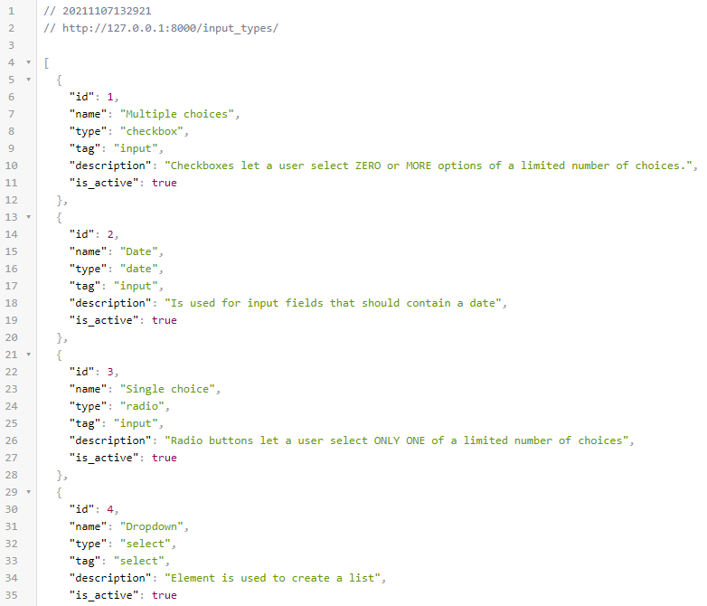
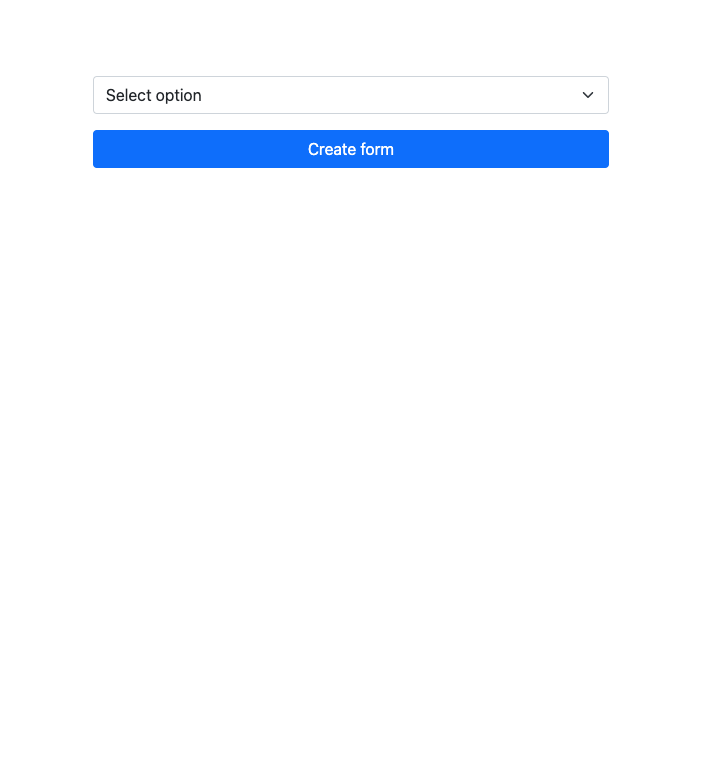

# Form-creator
### Create your own forms and analyze the results.

1. Clone or download this repository `git clone https://github.com/rodriguezespinoza0795/Form-creator.git`
2. Create your own virtual environment and activate it.  
**Windows:**  
	* `py -m venv venv `  
	* `source venv/Scripts/activate`

	**Mac OS**:
	* `virtualenv venv` or `virtualenv -p /usr/local/bin/python3 venv`
	* `source venv/bin/activate`
3. Install dependencies: `pip install -r requirements.txt`
4. Create databases and tables with the `db.sql` file.
5. Start server: `uvicorn sql_app.main:app --reload`
6. If you have a port error run the following commands
`sudo lsof -i:8080` and `kill -9 $PID`

* Access interactive documentation with Swagger UI: http://127.0.0.1:8000/docs
* Access interactive documentation with Redoc: http://127.0.0.1:8000/redoc

---

## Add a new model
1. **[Create a table in the database](https://styde.net/convenciones-de-nombres-de-bases-de-datos/)**  

	* **Table names**  
	1.1 Use lowercase and plural nouns. For example, some table names might be: `employees`, `notes`, `students`  
	1.1.2 In cases where you need more than one noun, separate them with an "underscore." For example: `product_types`, `art_books`, `physic_books`  
	* **Field / column / attribute names**  
	1.1 Use lowercase and singular nouns. Example: `name`, `description`
	1.2 In cases where you need more than one noun, separate them with an "underscore." For example: `birth_date`, `product_name`, `registration_date`
	* **Primary keys**  
	1.1 Name the primary keys of your tables as `id`  
	1.2 They must be of type unsigned large integer and auto-incrementing.  
	1.3 They should never allow null values
	* **Foreign keys**  
	1.1 Use a noun made up of the name of the table it came from (in lowercase and singular) followed by the suffix _id. For example: `category_id`, `user_id`, `product_id`  
	1.2 Since this field contains values ​​that are "primary key" in another table, you must also define it as a large unsigned integer type.
	1.3 They can allow null values.
	* **Special fields**  
	1.1 Add the special fields `created_at and` `updated_at` to the table.  
	1.2 These special fields must have TIMESTAMP data type and will indicate when the record was created and when it was last updated

	**EXAMPLE**
	```sql
	CREATE TABLE `c_form_input_types` (
	`id` bigint(20) unsigned NOT NULL AUTO_INCREMENT,
	`name` varchar(100) NOT NULL,
	`type` varchar(45) NOT NULL,
	`tag` varchar(45) NOT NULL,
	`description` varchar(255) DEFAULT NULL,
	`is_active` tinyint(4) NOT NULL DEFAULT 1,
	`created_at` timestamp NOT NULL DEFAULT current_timestamp(),
	`updated_at` timestamp NOT NULL DEFAULT current_timestamp() ON UPDATE current_timestamp(),
	PRIMARY KEY (`id`),
	UNIQUE KEY `name` (`name`)
	);
	``` 
2. **Add model in models.py**  
	**EXAMPLE**
	```python
	class Input_types(Base):
		__tablename__ = "c_form_input_types"

		id = Column(Integer, primary_key=True, index=True, unique=True)
		name = Column(String(100),unique=True)
		type = Column(String(45), primary_key=True)
		tag = Column(String(45))
		description = Column(String(255))
		is_active = Column(Boolean, default=True)
	```
3. **Add Schema in schemas.py**  
	**EXAMPLE**
	```python
	class InputTypeBase(BaseModel):
		name : str
		type : str
		tag : str
		description : Optional[str] = None
		is_active : bool

	class InputTypeCreate(InputTypeBase):
		pass

	class InputType(InputTypeBase):
		id: int

		class Config:
			orm_mode = True
	```
4. **Add crud in crud.py**  
	**EXAMPLE**
	```python
	def get_input_types(db: Session, skip: int = 0):
    	return db.query(models.Input_types).offset(skip).all()
	```
5. **create Endpoint in file main.py**
	**EXAMPLE**
	```python
	@app.get("/input_types/", response_model=List[schemas.InputType])
	def read_users(skip: int = 0, db: Session = Depends(get_db)):
		input_types = crud.get_input_types(db, skip=skip)
		return input_types
	```
6. Test the new endpoint: http://127.0.0.1:8000/input_types/

---

## Notes:
* You can review Python basics in this notebook [Notebook](https://colab.research.google.com/drive/1FZrk1hRIQNxssTlZbkwKl_1EXTKhe3c9?usp=sharing).
* You can review notes (in Spanish) of courses in this [Notion](https://natural-daffodil-061.notion.site/Clases-del-Curso-de-FastAPI-Fundamentos-Path-Operations-y-Validaciones-e0b98d98569b49cdaf884dedf9f62454)

## Last version


